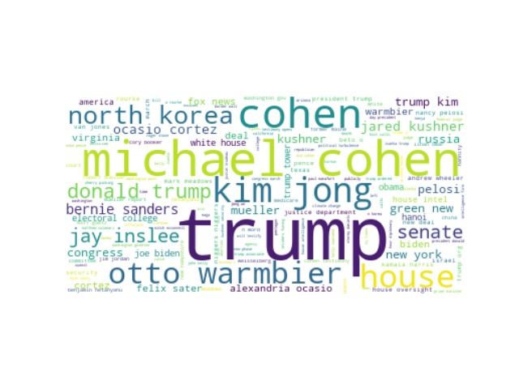

[](https://travis-ci.org/Abstraction-Support-Group/RedditSpeaks)

# RedditSpeaks - Find out what Reddit is saying

Reddit is a platform for hosting interest or place based communities.

RedditSpeaks is a project about extracting information from news articles shared on Reddit.

Currently, RedditSpeaks can identify the most common names mentioned in news
headlines.

View some results [here](docs/results.md)

## Install

Preferably, use a new Python environment.

```
pip install -r requirements.txt
```

## Usage

`cli.py` is meant for performing NLP tasks from command line.

Usage syntax: `python cli.py <command> <arguments>`

Current commands:
1. `pull` - download Reddit submissions and save to a file.
2. `names` - extract names from Reddit submissions, loaded from a file.
3. `view` - generate a wordcloud displaying the extracted names


To download Reddit submissions, run:
`python cli.py pull <subreddit name> --start <year, month, day> --end <year, month, day> --output <path to output file>`

To extract names from these downloaded submissions, run:
`python cli.py names --input <path to input file> --output <path to output file>`

To generate a wordcloud displaying these extracted names, run:
`python cli.py view --input <path to json file containing extracted names>`

Note: Within `Client.py`, the Reddit data is obtained from the [Pushshift API](https://github.com/pushshift/api)
and there is a 1 second delay between each call to the Pushshift API (to avoid spamming).

### Examples

To download submissions from [r/politics](https://www.reddit.com/r/politics/) 
between 1 March 2019 and 2 March 2019, run: `python cli.py pull politics --start 2019 3 1 --end 2019 3 2 --output politics.json`

Next, to extract names, run:
`python cli.py names --input politics.json --output names.json`

Next, to generate a wordlcoud, run:
`python cli.py view --input names.json`

Below is the word cloud generated for this time period:



| Name       | Number of associated titles | 
| ------------- |-----:|
| trump |267|
| michael cohen|100|
| cohen | 68|
|kim jong| 44 |
|house| 39|
|otto warmbier| 35|
|north korea| 34|
|donald trump|27|
|jay inslee|23|
|senate|23|

