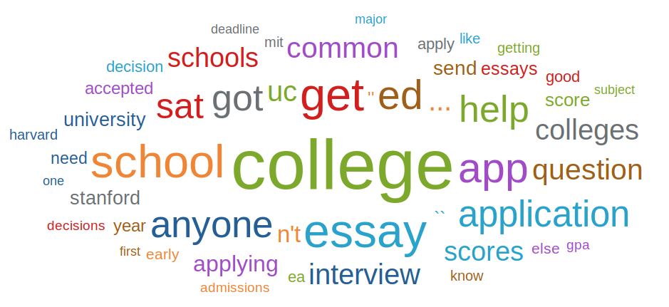
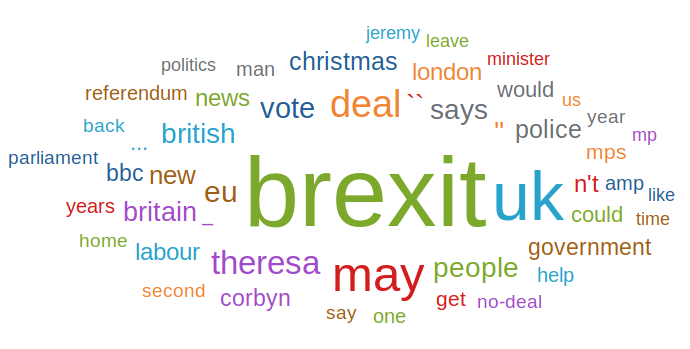

All wordclouds are generated using [ZingChart](https://www.zingchart.com/buy/)

A Reddit forum about college applications, over Nov 2018 - Dec 2018:

A Reddit forum about US news, over the last week of September 2018:

A Reddit forum about world news, over Nov 2018 - Dec 2018:

A Reddit forum about computer science career questions, over Nov 2018 - Dec 2018:

A Reddit forum about privacy, over Nov 2018 - Dec 2018:

A Reddit forum about the United Kingdom, over Nov 2018  - Dec 2018:

A Reddit forum about data analysis, over Nov 2018 - Dec 2018:

**"OC" is a common abbreviation used, meaning "Original Content"**
